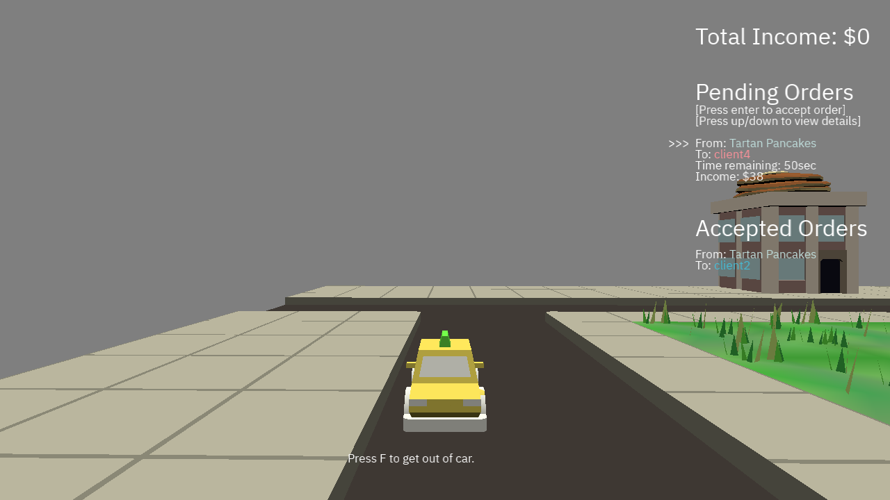

# GrubDash Simulator

Author:
 - Xiaoqiao Xu, Zhengyang Xia, Zizhuo Lin

Design:
 - Play as a food delivery person to delivery Cheesecake and pancake around the neighbourhood. Drive or walk to deliver the orders within the time limit.

Screen Shot:

How To Play:
 - Move with W,A,S,D. Use Up, Down, Left, Right to select order on the side bar. Press Enter to accept pending order. Press E to pick up order from store or delivery to client when you are near by. Earh as much income as you can.

Sources:
 - Road, grass and house parts by Jim McCann from city.blend
 - Cake ,pancake and table model by Yixin He from brunch.blend
 - Car model from https://kenney.nl/assets/car-kit

- C++ Library: https://github.com/effolkronium/random

This game was built with [NEST](NEST.md).

